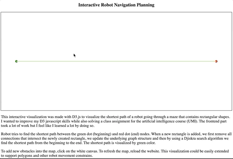

## Robot navigation task

Code in this repository describes the solution to the robot navigation problem.

This interactive visualization was made with D3.js to visualize the shortest path of a robot going through a maze that contains rectangular shapes. I wanted to improve my D3 javascript skills while also solving a class assignment for the artificial intelligence course (UMI). The frontend part took a lot of work but I feel like I learned a lot by doing so.

Following gif shows the ability of the developed D3.js interactive visualization:

To run the visualization all that is needed to done is to open the `index.html` file, the path will differ from mine:

> file:///Users/skalimat/fit-ni-umi/01_robot_navigation/index.html

Robot tries to find the shortest path between the green dot (beginning) and red dot (end) nodes. When a new rectangle is added, we first remove all connections that intersect the newly created rectangle, we update the underlying graph structure and then by using a Djiskra search algorithm we find the shortest path from the beginning to the end. The shortest path is visualized by green color.

To add new obstacles into the map, click on the white canvas. To refresh the map, reload the website. This visualization could be easily extended to support polygons and other robot movement constrains.